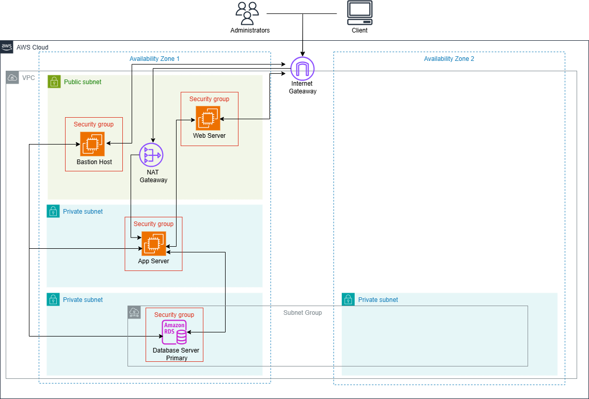

# Three-Tier Architecture on AWS

## Overview

This project implements a highly available **Three-Tier Architecture** in AWS. It consists of:

- **Presentation Layer**: Web Server (Apache HTTP)
- **Application Layer**: Application Server
- **Database Layer**: Amazon RDS (MariaDB)

The infrastructure is built using AWS services, including **VPC, Subnets, Security Groups, NAT Gateway, Internet Gateway, Route Tables, EC2, and RDS**.

---

## Architecture Diagram



---

## Components & Setup

### 1. **VPC & Networking**

- Create a **VPC** (CIDR: `192.168.0.0/16`).
- Set up **4 subnets**:
  - **1 Public Subnet** for Bastion Host & Web Server
  - **3 Private Subnets** for App Server & Database
- Enable public IP assignment for the public subnet.
- Deploy **Internet Gateway** for internet access.
- Deploy **NAT Gateway** for private instances to access the internet.
- Configure **Route Tables**:
  - Public subnet routes traffic via the Internet Gateway.
  - Private subnets route traffic via the NAT Gateway.

### 2. **Security Groups**

- **Bastion Host**: Allows SSH (`22`), HTTP (`80`), and HTTPS (`443`).
- **Web Server**: Allows traffic from anywhere on HTTP (`80`) & HTTPS (`443`).
- **App Server**: Allows ICMP (ping) from Web Server & SSH (`22`) from Bastion.
- **Database**: Allows MySQL/Aurora (`3306`) from App Server & Bastion.

### 3. **Compute Resources**

#### **Bastion Host**

- **Amazon Linux 2** (`t2.micro`)
- Placed in the public subnet
- Security Group: **Bastion Host SG**

#### **Web Server**

- **Amazon Linux 2** (`t2.micro`)
- Placed in the public subnet
- Uses Apache HTTP Server
- Security Group: **Web Server SG**
- User Data:

```bash
#!/bin/bash
sudo yum update -y
sudo amazon-linux-extras install -y lamp-mariadb10.2-php7.2 php7.2
sudo yum install -y httpd
sudo systemctl start httpd
sudo systemctl enable httpd
```

#### **App Server**

- **Amazon Linux 2** (`t2.micro`)
- Placed in a private subnet
- Security Group: **App Server SG**
- User Data:

```bash
#!/bin/bash
sudo yum install -y mariadb-server
sudo service mariadb start
```

### 4. **Database Layer**

- **Amazon RDS**
- **MariaDB** (Free Tier)
- No public access
- Placed in a private subnet
- Security Group: **Database SG**
- Initial Database Name: `mydb`
- Username: `Your_Username`
- Password: `Your_Password`
- Automated backups & encryption disabled (for faster setup)

---

## Testing & Access

### 1. **Upload SSH Keys to Bastion Host**

```bash
chmod 400 labsuser.pem
scp -i "./Downloads/Your_Keys.pem" "./Downloads/Your_Keys.pem" Your_User@<Bastion_Host_Public_IP>:/home/Your_User

```

### 2. **SSH into Bastion Host & Connect to App Server**

```bash
ssh -i Your_Keys.pem Your_User@<Bastion_Host_Public_IP>
ssh -i Your_Keys.pem Your_User@<App_Server_Private_IP>

```

### 3. **Test Connectivity**

#### Ping Web Server:

```bash
ping <Web_Server_Private_IP>
```

#### Connect to Database from App Server:

```bash
mysql --user=root --password='Your_Password' --host=<Database_Endpoint>
SHOW DATABASES;
```

---

## Conclusion

This setup provides a robust, scalable, and secure **Three-Tier Architecture** using AWS services. The **Bastion Host** enables secure SSH access, the **Web Server** hosts applications, and the **Database** is securely placed in a private subnet.

✅ **AWS Best Practices Implemented:**

- Segmentation via **VPC & Subnets**
- Secure connectivity via **NAT Gateway & Security Groups**
- High availability with **Multi-AZ Architecture** (optional for production)

This project serves as a foundational blueprint for deploying web applications on AWS!
